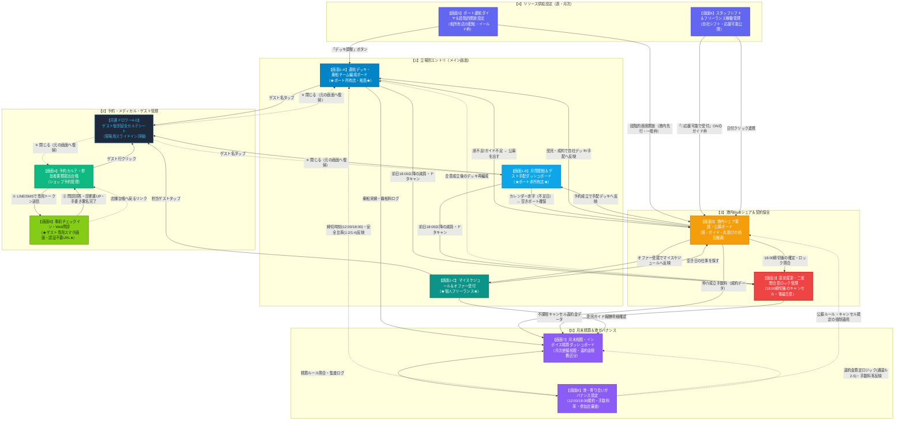

# Minatowa（ミナトワ）UI設計仕様書

- **文書ステータス**: 設計確定版 (v1.0 - 港単位寄り合い相互支援＆ハイブリッド予約・相殺プラットフォーム)
- **策定日**: 2026年9月26日
- **対象システム**: Minatowa フロントエンド / 画面UI
- **配置場所**: `eventargsweb/docs/prd/Minatowa/UI/UI設計.md`

---

## 1. UI設計の基本哲学と現場要件

沖縄のダイビング現場（船長、ガイド、予約担当、ショップオーナー）は、オフィスデスクではなく、**「直射日光下のボート上」「濡れた手」「揺れる船上」「スマートフォン片手」「夕方17:00〜18:00の怒涛の締め切り作業」**という過酷な現場条件下でシステムを操作します。

一般的なSaaSのように1つのダッシュボードに「予約」「運航」「経理」「検索」を詰め込むと、現場の認知負荷が爆発して操作ミスを引き起こし、海の事故や言った言わないの金銭トラブルにつながります。

### 4大UI設計原則
1. **現場ファーストの画面分離（1画面1ミッション）**
   - メイン画面は「今日の海・明日の段取り（安全比率・出航管理）」に特化。月次経理やマスタ設定などの非日常業務は完全に別画面に隔離します。
2. **安全基準違反・書類不備の物理的ブロック**
   - ガイド1名あたりの引率比率（体験1:2、ファン初級1:4等）を超過した場合や、メディカル診断書未提出のゲストがいる場合、画面上に明瞭なアラートを出し、出航ステータスの更新をシステム的にブロックします。
3. **ハイブリッド運用の完全担保（老舗エクセル店 vs Web完結店）**
   - 独自の顧客管理（エクセルや紙カルテ）を運用している老舗ショップのために、「自社保証トグル（自社が責任を持って紙で確認済）」をワンクリックで切り替えられるUIを提供し、現場の運用を止めません。
4. **トラブルを未然に防ぐ「合意ロック」の可視化**
   - 18:00締め切り後の直前キャンセル・減員・海況悪化において、港共通BtoBキャンセルポリシー（前日午前無料・午後100%等）の適用結果と双方の合意状況を視覚的にロック表示します。

---

## 2. 画面一覧・体系マップ（全9画面）

```text
┌─────────────────────────────────────────────────────────────────────────────┐
│                             【Minatowa 画面体系】                            │
├────────────────────────────────┬────────────────────────────────────────────┤
│ ① 現場・運航（立場別メイン画面）│ 【画面1-A】運航デッキ・乗船チーム編成ボード (ボート所有店) │
│                                │ 【画面1-B】月間配船＆ゲスト手配ダッシュボード (ボート非所有店)│
│                                │ 【画面1-C】マイスケジュール＆オファー受付ボード (フリーランス)│
│                                │ 【画面2】港内シェア要請・公募ボード (ボート/イントラ)    │
│                                │ 【画面3】直前変更・二者間合意ロック管理 (締め後/キャンセル)│
├────────────────────────────────┼────────────────────────────────────────────┤
│ ② 予約・安全管理 (日常業務)    │ 【画面4】予約カルテ・参加者書類提出台帳 (メディカル/保証)│
│                                │   └─【共通ドロワー4-D】ゲスト個別安全カルテ (客詳細シート) │
├────────────────────────────────┼────────────────────────────────────────────┤
│ ③ リソース供給設定 (週/月次)   │ 【画面5】ボート運航ダイヤ＆段階的座席開放設定 (ボート所有店)│
│                                │ 【画面6】スタッフシフト＆フリーランス稼働エントリー    │
├────────────────────────────────┼────────────────────────────────────────────┤
│ ④ 精算・ガバナンス (月末/管理) │ 【画面7】月末相殺・インボイス精算ダッシュボード        │
│                                │ 【画面8】港・寄り合いガバナンス設定 (管理者用)          │
├────────────────────────────────┼────────────────────────────────────────────┤
│ ⑤ ゲスト専用 (スマホ・外部)    │ 【画面9】ゲスト事前チェックイン・Web問診 (トークンURL) │
└────────────────────────────────┴────────────────────────────────────────────┘
```

| # | 画面名 | 対象ユーザー | 利用タイミング | 主な役割・機能 |
|:---:|---|---|---|---|
| **1-A** | **運航デッキ・乗船チーム編成ボード**<br>（★ボート所有店メイン★） | 船長、ボート所有店 | 毎朝の出港前・夕方の翌日段取り時 | **自社船の運航と安全引率チーム管理**<br>・ボート定員と安全比率メーター（1:2/1:4等）<br>・書類不備（メディカル未提出）の出航前アラート<br>・海上保安庁・港湾局提出用の乗船名簿PDF即時印刷 |
| **1-B** | **月間配船＆ゲスト手配ダッシュボード**<br>（★ボート非所有店メイン・1画面統合★） | ボート非所有店、都市型店 | 数ヶ月前〜日々の予約・段取り時 | **1画面で月間先回りキープから当日の送迎・手配まで完結**<br>・上段：月間カレンダー（自社客数 照合 ボート席、席不足警告）<br>・下段：選択日の手配デッキ（空きボート先行確保、送迎計画、書類確認） |
| **1-C** | **マイスケジュール＆オファー受付**<br>（★フリーランスメイン★） | 個人フリーランス | 毎日（スマホ片手） | **自分の仕事獲得と現場引率確認**<br>・明日の乗船先（船・集合時間・日当）と担当ゲスト<br>・ショップからの応援オファー承諾／辞退<br>・空き日の能動的エントリー（「この日働けます」） |
| **2** | **港内シェア要請・公募ボード**<br>（ボート席＆ガイドマッチング） | 全ショップ、船長、フリーランス | 数ヶ月前の繁忙期ブロック〜前日直前・当日緊急時まで通年 | **港の仲間ショップ間で席・ガイド・ゲストを相互融通するBtoB市場**<br>・3大委託形態「ボート席のみ」「ゲスト丸投げ」「ガイド応援派遣」<br>・【早期手配】数ヶ月先・連休のボート先行ブロックや繁忙期ガイド確保<br>・【直前調整】前日18:00合意ロック前の残席補填や端数ゲストの丸投げ受託<br>・【当日緊急】エンジントラブルや急病時の緊急レスキュー受入 |
| **3** | **直前変更・二者間合意ロック管理**<br>（契約詳細・キャンセル精算） | 両ショップ担当者 | 締め切り後の人数変更・キャンセル時 | **言った言わないを防ぐ合意画面**<br>・前日18:00以降の減員・ドタキャン申請<br>・港共通BtoBキャンセル規定の自動計算・適用と電磁ロック |
| **4** | **予約カルテ・参加者書類提出台帳**<br>（メディカル・免責管理） | 店舗スタッフ、予約担当 | 予約受付時、顧客情報確認時 | **自社予約とゲストカルテ台帳**<br>・代表者予約と参加者全員の明細（Cカード・器材）<br>・メディカルチェック回答履歴・自社保証のワンクリック切替 |
| **4-D** | **【共通ドロワー】ゲスト個別安全カルテシート**<br>（客詳細・現場安全確認） | 船長、引率ガイド、店舗スタッフ | 画面1-A/1-B/4等でゲスト名をタップした時 | **現場で即座に開くゲストの安全・健康・器材情報シート**<br>・Cカード（団体・ランク・本数・最終潜水日）<br>・メディカルチェック（問診回答・医師診断書・委託元自社保証ログ）<br>・器材サイズ（My器材/レンタル詳細）、緊急連絡先<br>※他社委託ゲストは「顧客引き抜き防止」のため私用連絡先・直接販売価格を自動マスキング |
| **5** | **ボート運航ダイヤ＆段階的開放設定** | 船長、ボート所有店 | 週1回・月1回（スケジュール確定時） | **自社船の運航便と空席公開設定（供給側）**<br>・「30日前10席、14日前追加5席、直前全開放」の自動開放設定 |
| **6** | **スタッフシフト＆フリーランス稼働管理** | スタッフ、フリーランス | 予定確定時、空き日発生時 | **ガイドの稼働と派遣枠の管理**<br>・自社イントラの保護（デフォルト非公開・余剰時のみ派遣開放） |
| **7** | **月末相殺・インボイス精算ダッシュボード** | ショップオーナー、経理担当 | 月末〜翌月初の締め作業時（月1回） | **現金の往復送金をゼロにする経理画面**<br>・港グループ内でのショップ間売掛・買掛の自動相殺計算<br>・乗船料・手数料・ガイド料・キャンセル料の適格請求書出力 |
| **8** | **港・寄り合いガバナンス設定** | 港寄り合い幹事・管理者 | 規約改定時（年数回） | **港ルールの設定画面**（締め切り18:00、キャンセル規定、相殺期日） |
| **9** | **【ゲスト専用】事前チェックイン・Web問診**<br>（スマホ専用・認証不要） | 一般観光客ダイバー | 乗船の数日前〜前日 | **海に行く前のスマホ問診・提出画面**（WRSTC問診・診断書UP・電子署名） |

---

## 3. 各画面の詳細仕様とワイヤーフレーム

### 【画面1-A】ボート所有店メイン：運航デッキ・乗船チーム編成ボード
自社ボートを所有・運航するショップ（船長）が開く画面。**「船の定員制約」と「安全引率比率制約」の二重キャパシティ**をリアルタイムに可視化し、安全な運航を保証します。

```text
+----------------------------------------------------------------------------------------------------+
| [Minatowa] 那覇北マリーナ寄り合い | ログイン: パラダイス倶楽部 (船長: 上原)                [🔔 通知: 2件] [設定] |
+----------------------------------------------------------------------------------------------------+
| ◀ [ 2026年9月27日(日) ] ▶   [ 今日 ]  [ 明日(段取り中) ]  [ 週間カレンダー ]        [＋ 新規予約/手配]  |
+----------------------------------------------------------------------------------------------------+
| ⚠️ 【出航前アラート】                                                                               |
| ・ボート1便『美ら海丸』: チームBの安全比率がオーバーしています（体験ダイブ ガイド1: ゲスト3 ❌）        |
| ・受託ゲスト 佐藤様 (サンライズダイブ様委託): メディカル未提出 (出航まであと14時間・要確認)         |
+----------------------------------------------------------------------------------------------------+
| 🚢 ボート運航状況 (自社ボート & チャーターボート)                                                  |
|                                                                                                    |
|  ■ 美ら海丸 (定員: 25名 / 船長除く) ──────────── [出航: 08:30 / ケラマ2便 / ランチ有] [運航前▼]     |
|    現在の乗船総数: 18名 / 空き: 7席 (港公開枠: 3席 / 自社キープ: 4席)                             |
|                                                                                                    |
|    ┌─【チームA】ファンダイブ中級 (引率比率: 1 : 6 限界 / 現状 1:5 ✅ OK) ────────────────────────┐   |
|    │ ガイド: 宮城 (自社スタッフ / 潜水士・MSDT)                                                 │   |
|    │ ゲスト:                                                                                     │   |
|    │  1. 田中 健一 (自社)   [AOW / 45本]  [書類: 済(2026/04)] [器材: フル]                     │   |
|    │  2. 田中 恵子 (自社)   [AOW / 40本]  [書類: 済(2026/04)] [器材: 重器材のみ]                 │   |
|    │  3. Smith John (委託元: オーシャンズ) [RED / 120本] [書類: 済(自社保証)] [英語対応]        │   |
|    │  4. 鈴木 一郎 (自社)   [OW / 12本]   [書類: 済(2026/08)] [器材: なし]                     │   |
|    │  5. 高橋 雅人 (自社)   [OW / 15本]   [書類: 済(2026/08)] [器材: フル]                     │   |
|    └────────────────────────────────────────────────────────────────────────────────────────────┘   |
|    ┌─【チームB】体験ダイビング (引率比率: 1 : 2 厳格 / 現状 1:3 ❌ 違反警告！) ──────────────────┐ |
|    │ ガイド: 金城 (自社スタッフ / OWSI)                                                         │ |
|    │ ゲスト:                                                                                     │ |
|    │  1. 山田 太郎 (自社)   [体験 / 初回] [書類: 済] [病歴なし]                                  │ |
|    │  2. 山田 花子 (自社)   [体験 / 初回] [書類: 済] [病歴なし]                                  │ |
|    │  3. 佐藤 隆 (委託元: サンライズ) [体験 / 2回目] [書類: ⚠️未提出・仮押さえ中]               │ |
|    │  [＋ ガイド追加 (他社応援またはフリーランスをアサイン)]  [ゲストを他チームへ移動]            │ |
|    └────────────────────────────────────────────────────────────────────────────────────────────┘   |
|                                                                                                    |
|    [ 🖨️ 海上保安庁・港提出用 乗船名簿PDF出力 ]   [ 👥 チーム編成ドラッグ＆ドロップ調整 ]           |
+----------------------------------------------------------------------------------------------------+
```

#### 表示要素と機能
- **安全比率（`safety_ratio_rules`）バリデーション**:
  - ガイド1人あたりのゲスト上限（体験1:2、ファン初級1:4、中級1:6、上級1:8、スキン1:10）を超過した場合、チームヘッダーが赤色反転し、出航ステータス変更ボタンを無効化。
- **書類ステータスバッジ（`medical_responsibility_type`）**:
  - `QUALIFIED`（乗船適格＝緑）
  - `SEAT_HELD_PENDING_DOCS`（書類待ち仮押さえ＝黄）
  - `CANCELLED_DOCS_DEFECT`（書類不備によるキャンセル解放＝赤・打消線）
- **乗船名簿PDF即時印刷**:
  - 港湾局や海上保安庁に提出する「乗船名簿（緊急連絡先・血液型・生年月日付き）」を法令書式で即座に出力。

---

### 【画面1-B】ボート無店メイン：自社ゲスト手配＆配船ダッシュボード
ボートを持たない都市型ショップやガイド専業店が開く画面。**「明日・明後日の自社ゲストが全員無事に船に乗れているか（未手配ゼロ）」**を最優先で管理します。

```text
+----------------------------------------------------------------------------------------------------+
| [Minatowa] 那覇北マリーナ寄り合い | ログイン: 那覇マリン (ボート無ショップ / 担当: 比嘉) [🔔 通知: 1件] |
+----------------------------------------------------------------------------------------------------+
| ◀ [ 2026年9月27日(日) ] ▶   [ 今日 ]  [ 明日(段取り中) ]  [ 週間カレンダー ]        [＋ 新規予約受付]  |
+----------------------------------------------------------------------------------------------------+
| ⚠️ 【手配アラート】                                                                                 |
| ・明日 09/27 の自社予約 8名中、2名がボート未手配です！ (18:00締め切りまで あと 01時間42分)         |
+----------------------------------------------------------------------------------------------------+
| 📋 明日の自社ゲスト 配船・乗船手配状況 (計3グループ / 8名)                                         |
|                                                                                                    |
|  ■ グループ1：ファンダイブ中級 (3名) ─────────────────────────────────────────────────────────   |
|    ・配船先ボート: 【美ら海丸 (パラダイス倶楽部)】 ケラマ2便 (08:30出航 / 那覇北マリーナ発)                    |
|    ・引率体制: 【自社イントラ同乗】 ガイド: 自社スタッフ 仲宗根 (MSDT)                             |
|    ・手配ステータス: [ 🟢 乗船手配完了・確定 ]                                                     |
|    ・ゲスト書類: 田中様(済), 田中恵子様(済), 鈴木様(済) ── [ 全員適格 OK ]                         |
|    ・精算見込: 乗船料 ¥8,500 × 3名 ＝ ¥25,500 (月末相殺)                                           |
|                                                                                                    |
|  ■ グループ2：体験ダイビング (3名) ──────────────────────────────────────────────────────────   |
|    ・配船先ボート: 【誠海丸 (マリンサポート)】 ケラマ便 (08:30出航 / 那覇北マリーナ発)                   |
|    ・引率体制: 【受託側丸投げ委託】 (自社スタッフ不足のため、先方ショップのガイド引率を依頼)       |
|    ・手配ステータス: [ 🟢 乗船・引率委託完了 ]                                                     |
|    ・ゲスト書類: 山田様(済), 山田花子様(済), 高橋様(済) ── [ 全員適格 OK ]                         |
|    ・精算見込: 乗船＋ガイド委託料 ¥13,000 × 3名 ＝ ¥39,000 (月末相殺)                              |
|                                                                                                    |
|  ■ グループ3：ファンダイブ初級 (2名) ── ⚠️【ボート未手配！至急対応要】 ────────────────────   |
|    ・ゲスト: 佐々木 健太 様、井上 翔 様 (OWライセンス所持 / フルレンタル希望)                      |
|    ・引率予定: 自社スタッフ 金城 が引率可能 (ボートの席だけが2席足りない状態)                     |
|    ・手配ステータス: [ 🔴 ボート席が未確保です！ ]                                                 |
|    ・アクション:                                                                                   |
|       [ 🔍 那覇北マリーナの空きボート席を探す (美ら海丸・誠海丸の残席確認) ]                             |
|       [ 📢 港グループ全体へ「明日ケラマ2席」の公募を一斉送信する ]                                 |
+----------------------------------------------------------------------------------------------------+
| 🚐 明日朝の送迎・港集合サマリー                                                                    |
|  ・07:00 那覇市内ホテルお迎え (佐々木様・井上様 2名) ──▶ 那覇北マリーナへ送迎                            |
|  ・07:45 那覇北マリーナ現地集合 (グループ1・グループ2 計6名)                                     |
+----------------------------------------------------------------------------------------------------+
```

#### 表示要素と機能
- **客起点の手配カード**: 自社予約のグループごとに「どのボートに乗るか」「自社ガイド同乗か丸投げか」「書類は揃っているか」を表示。
- **未手配アラート＆ワンタップ手配**: ボートが未定のゲストに対して、空席検索または港内公募ボタンをダイレクトに表示。
- **送迎・集合サマリー**: 自社が担当する那覇市内等のホテル送迎リストと、港現地集合時刻を自動集計。

---

### 【画面1-C】フリーランスメイン：マイスケジュール＆オファー受付ボード
個人事業主のフリーランスインストラクターがスマホで開く専用画面。**「明日の現場（集合場所・引率ゲスト）」**と**「仕事の獲得（オファー承認・空きシフト登録）」**を親指1本で完結させます。

```text
+----------------------------------------------------+
| [Minatowa] 屋良 朝徳 (フリーランス)  [🔔 オファー: 1件] |
+----------------------------------------------------+
| 📅 明日の現場: 2026年9月27日(日)                   |
|                                                    |
|  【 確定案件 】                                     |
|  🚢 美ら海丸 (株式会社パラダイス倶楽部様)                 |
|  ・集合時刻: 07:45 (08:30出航・ケラマ2便)          |
|  ・集合場所: 那覇北マリーナ 北側桟橋             |
|  ・日当報酬: ¥15,000 (月末相殺精算・振込)          |
|  ・担当業務: 体験ダイビング (チームB ペア引率)     |
|                                                    |
|  👥 担当ゲスト (2名):                               |
|   1. 山田 太郎 様 (28歳・体験初回・書類適格 ✅)    |
|   2. 山田 花子 様 (26歳・体験初回・書類適格 ✅)    |
|                                                    |
|  [ 🗺️ 那覇北マリーナの地図 ]  [ 📞 船長へ電話 ]  |
+----------------------------------------------------+
| 📩 新着の応援派遣オファー (1件届いています)         |
|                                                    |
|  ■ 9月28日(月) チービシ便 ガイド応援募集           |
|  ・依頼元: パシフィックダイブ 様                   |
|  ・業務内容: ファンダイブ初級引率 (4名)            |
|  ・日当提示: ¥14,000 (ランチ支給)                  |
|  ・回答期限: 本日 18:00 (あと1時間42分)            |
|                                                    |
|  [ 🟢 この仕事を受ける (承諾) ]   [ 今回は辞退する]|
+----------------------------------------------------+
| 🗓️ 稼働カレンダー (タップして「仕事募集中」に切替) |
|  ・09/29(火): [ ⚪ 空き登録する (那覇北・北谷希望) ]|
|  ・09/30(水): [ ⚪ 空き登録する (那覇北・北谷希望) ]|
|  ・10/01(木): [ 🔒 休日に設定中 ]                  |
|  ・10/02(金): [ 🟢 稼働募集中 (オファー待ち) ]     |
+----------------------------------------------------+
| 💰 今月の確定報酬サマリー                          |
|  ・稼働日数: 9日 ｜ 確定額: ¥135,000               |
+----------------------------------------------------+
```

#### 表示要素と機能
- **スマホファースト設計**: ボート上や移動中でも片手親指で操作可能。
- **担当ゲストカルテの事前把握**: 明日引率するダイバーのレベル・健康状態（適格か）を確認。
- **オファー即時承認/辞退**: 各ショップからの派遣打診をワンタップで回答。
- **能動的カレンダー登録**: 自分の空き日をワンタップで港全体へ公開。

---

### 【画面2】港内シェア要請・公募ボード
港の仲間ショップ間で「ボート席」「ゲスト引率」「助っ人ガイド」を相互融通するBtoBリソースマッチング画面。
前日夕方に限らず、**「数ヶ月先の早期先行ブロック」から「日々の予約調整」「前日夕方の最終合意ロック」「当日朝の緊急レスキュー」まで通年で稼働**します。

```text
+----------------------------------------------------------------------------------------------------+
| 港内シェア要請・公募ボード (那覇北マリーナ寄り合い)                      [＋ 新規シェア要請を出す]       |
+----------------------------------------------------------------------------------------------------+
| 【利用フェーズ別タブ】                                                                             |
| [ すべて (24件) ]  [ 📅 早期先行ブロック (1〜3ヶ月先・連休) ]  [ ⏰ 直前・合意ロック前 (明日・今週末) ]  [ 🚨 当日緊急 ] |
| ────────────────────────────────────────────────────────────────────────────────────────────────── |
| 期間絞り込み: [ 2026/09/27 (明日) ▼ ]  手配形態: [ すべて ▼ ]  エリア: [ ケラマ / チービシ ▼ ]     |
+----------------------------------------------------------------------------------------------------+
| 📢 【自社が出している要請】 (他社からの応募を承認・成約する)                                       |
| ────────────────────────────────────────────────────────────────────────────────────────────────── |
|  [要請#104] 明日 09/27 ケラマ便 | 体験ダイビング 1名 (女性・20代)  【直前・18:00ロック対象】        |
|  ・委託形態: 【ゲスト丸投げ委託】 (ボート席＋ガイド引率を希望)                                     |
|  ・提示条件: 乗船料 ¥8,000 ＋ 受託ガイド料 ¥5,000 (規定手数料 15% 差引)                           |
|  ・現在の応募状況:                                                                                 |
|     ├─ 🚢 誠海丸 (マリンサポート様): 『受入可能 (体験枠空きあり)』 ─────────── [ 承認して成約 ]   |
|     └─ 👤 屋良 イントラ (フリーランス): 『ガイドのみ担当可能 (船は別手配要)』 ─ [ 保留 ]          |
|  ・前日合意ロックまで: あと 2時間15分 (18:00電磁ロック)                                            |
| ────────────────────────────────────────────────────────────────────────────────────────────────── |
|  [要請#088] 来月 10/11(日) 連休中日 ケラマ便 | ボート席 4名希望  【早期先行ブロック】              |
|  ・委託形態: 【乗合ボート席のみ】 (自社イントラ金城が同乗引率 / 席のみ確保)                        |
|  ・提示条件: 乗船料 ¥8,500/名 × 4名 ＝ ¥34,000                                                     |
|  ・現在の応募状況: 🚢 オーシャンズII号 (オーシャンズ様): 『4席受入OK』 ────── [ 承認して成約 ]   |
+----------------------------------------------------------------------------------------------------+
| 📥 【港の仲間ショップからの公募・ヘルプ要請】 (受託して売上を立てる)                               |
| ────────────────────────────────────────────────────────────────────────────────────────────────── |
|  [公募#105] 明日 09/27 ケラマ便 | ファン中級 2名 (ご夫婦・アドバンス所持)                          |
|  ・依頼元: シーフレンド那覇北 (担当: 比嘉)                                                        |
|  ・委託形態: 【乗合ボート席のみ】 (依頼元のイントラが同乗・自社ボートの席だけを提供)              |
|  ・条件: 乗船料 ¥8,500/名 × 2名 ＝ ¥17,000 (ランチ付)                                             |
|  ・自社ボート『美ら海丸』空き状況: 残り17席あり (余裕あり)                                         |
|  [ ✋ 受入エントリーする (美ら海丸に配船) ]   [ 辞退 / スキップ ]                                  |
| ────────────────────────────────────────────────────────────────────────────────────────────────── |
|  [公募#106] 明日 09/27 沿岸・チービシ便 | ガイド応援派遣 1名募集                                    |
|  ・依頼元: パシフィックダイブ (船はあるがスタッフ急病のためガイド急募)                            |
|  ・日当: ¥15,000 (終日・チービシ2便)                                                               |
|  [ 自社空きスタッフを派遣する ]                                                                    |
| ────────────────────────────────────────────────────────────────────────────────────────────────── |
|  [公募#091] 来月 10/10(土)〜10/12(月祝) 秋の連休 | 助っ人ガイド 2名募集 【早期繁忙期手配】         |
|  ・依頼元: マリンクラブ那覇北 (3連休の予約殺到につき事前確保)                                      |
|  ・日当: ¥16,000/日 (連休特別手当込)                                                               |
|  [ フリーランス/自社スタッフをエントリー ]                                                         |
+----------------------------------------------------------------------------------------------------+
```

#### 表示要素と機能
- **4つの利用タイムライン（フェーズ）**:
  1. `ADVANCE`（早期先行ブロック：1〜3ヶ月先の連休・トップシーズンの席・ガイド確保）
  2. `ADJUSTMENT`（予約調整：数日前〜数週前の予約端数やチーム比率調整による丸投げ/受託）
  3. `LOCK_CUTOFF`（前日直前：前日18:00合意ロック前の残席補填・最終確定）
  4. `URGENT`（当日緊急：エンジン故障・急病・海況急変による緊急振替）
- **3大委託モード（`contract_type`）の完全分離**:
  1. `BOAT_ONLY`（乗合ボート席のみ：自社ガイドが同乗）
  2. `FULL_PACKAGE`（ゲスト丸投げ委託：席＋相手ガイド引率）
  3. `STAFF_ONLY`（イントラ応援派遣：船はあるが人が足りない）
- **自社リソース・スケジュール自動照合バッジ（Smart Availability Match）**:
  - 各公募案件に対し、自社ボート（画面1-A空き残席）やスタッフ稼働表（画面1-C）とリアルタイムに自動突合。
  - `🟢 受入可能（美ら海丸 空き17席）`: ボート席・スタッフが充足しており、見るまでもなく即エントリー可能
  - `🟡 要調整（空き1席 / 体験ガイド別途要）`: 席や資格条件がギリギリのため確認が必要
  - `🔴 受入不可（満席 / 予定重複）`: 自社船が既に満席、またはスタッフが終日稼働済で受託不可
- **「自社の予定で受入可能な案件のみ表示」ワンタップフィルター**:
  - チェックボックス/トグルスイッチでONにすると、受入不可な案件を自動除外し、「今すぐ受託して売上を立てられる案件」だけに即座に絞り込み可能。
- **成約後の各画面への自動連携**:
  - `BOAT_ONLY` / `FULL_PACKAGE` 成約 ➔ 自社または相手方の【画面1-A】運航デッキ（チーム編成・乗船名簿）へ即時反映。
  - `STAFF_ONLY` 成約 ➔ ガイド側の【画面1-C】マイスケジュールへ即時反映。
- **18:00前日合意ロックとの連動**:
  - 前日18:00を跨ぐと未成約案件は自動クローズまたは条件再確認となり、成約済案件は【画面3】の二者間電磁ロック対象としてキャンセル料100%保全。

---

### 【画面3】直前変更・二者間合意ロック管理
締め切り時刻（前日18:00）以降の人数変更、当日朝のドタキャン、海況悪化時の清算合意画面。

```text
+----------------------------------------------------------------------------------------------------+
| 直前変更・キャンセル合意（契約番号: MC-20260927-004）                                             |
+----------------------------------------------------------------------------------------------------+
| ■ 元契約サマリー                                                                                  |
|  ・委託元: サンライズダイブ ──▶ 受託先: パラダイス倶楽部 (ボート: 美ら海丸)                              |
|  ・対象日: 2026/09/27 ケラマ便 | 体験ダイビング 2名                                                |
|  ・約定金額: 乗船・受託料 合計 ¥26,000                                                             |
+----------------------------------------------------------------------------------------------------+
| ⚡ 直前変更・キャンセル申請内容                                                                    |
|  ・変更申請元: サンライズダイブ (申請日時: 2026/09/26 16:30 - 前日午後)                             |
|  ・変更内容: 2名のうち 1名キャンセル（同行者1名のみ参加）                                         |
|  ・理由区分: [ ゲスト自己都合（体調不良・私用） ▼ ]                                                |
|  ・適用キャンセルポリシー: 【港共通BtoB規定 第4条 (前日午後〜当日キャンセル)】                    |
|     ▶ 規定料率: 100% (受託ショップのボート売上全額保証)                                            |
|                                                                                                    |
|  【相殺精算への反映予定】                                                                          |
|   1. 参加者 佐藤 隆 (参加): 乗船受託料 ¥13,000 (通常請求)                                          |
|   2. 参加者 佐藤 雅 (取消): 相殺キャンセル料 ¥13,000 (BtoB保全売上として受託側に100%計上)         |
|   ----------------------------------------------------------------------------------               |
|   受託側 (パラダイス倶楽部) 請求額: ¥26,000 (売上全額キープ)                                             |
|   委託元 (サンライズ) 支払額: ¥26,000 (※顧客への請求は委託元の独自規定に基づき自社で徴収)         |
+----------------------------------------------------------------------------------------------------+
| ✍️ 相互合意ステータス (双方がボタンを押すまで変更ロック)                                            |
|  ・委託元 (サンライズダイブ): [ ✅ 合意済 (2026/09/26 16:32 比嘉) ]                                |
|  ・受託先 (パラダイス倶楽部):       [ 🟢 上記内容で相殺合意する ]   [ 理由を確認・チャットで協議 ]       |
+----------------------------------------------------------------------------------------------------+
```

#### 表示要素と機能
- **BtoBキャンセルポリシーの自動算定**:
  - 前日午前12:00まで ＝ キャンセル料 0%（無料解放）
  - 前日午後（12:00〜18:00）および当日・無断 ＝ キャンセル料 100%（受託ボート売上全額保全）
  - 海況悪化・欠航（船長判断） ＝ キャンセル料 0%（不可抗力免責）
- **二者間合意ロック（`status: pending_agreement`）**:
  - 双方が「合意」ボタンを押すまで相殺台帳には反映されず、変更内容が保留状態で電磁記録されます。

---

### 【画面4】自社予約・ゲスト安全管理台帳
自社の予約受付と、ゲストごとのメディカル・免責書類・Cカードの回収進捗を管理する画面。

```text
+----------------------------------------------------------------------------------------------------+
| 予約・ゲスト安全管理台帳                                           [＋ 新規予約登録] [エクセル取込]|
+----------------------------------------------------------------------------------------------------+
| 検索: [ 代表者名 / 予約番号 ]  利用日: [ 2026/09/27 ]  書類ステータス: [ 不備・要対応のみ ▼ ]       |
+----------------------------------------------------------------------------------------------------+
| 予約番号: R-20260927-08 | 申込チャネル: [ じゃらんnet ] | 代表者: 山田 太郎 様 (計2名)             |
| 参加日程: 2026/09/27 (ケラマ体験ダイブ) | 配船: 自社ボート 美ら海丸                               |
| ────────────────────────────────────────────────────────────────────────────────────────────────── |
|  【参加者1】 山田 太郎 (28歳・男性)                                                               |
|    ・ステータス: [ 🟢 乗船適格 (QUALIFIED) ]                                                       |
|    ・メディカルチェック: [ 回答済 (全項目NO・医師診断書不要) ]                                     |
|    ・免責同意書: [ 署名済 (2026/09/20 Web署名) ]                                                   |
|    ・器材サイズ: 身長175cm / 体重68kg / 足27.0cm                                                   |
|                                                                                                    |
|  【参加者2】 山田 花子 (26歳・女性)                                                               |
|    ・ステータス: [ 🟡 書類待ち仮押さえ (SEAT_HELD_PENDING_DOCS) ]                                   |
|    ・メディカルチェック: [ ⚠️ 問診で「喘息の既往歴」あり ── 医師の評価証明書が未提出 ]            |
|    ・提出期限: 2026/09/26 14:00 (出航18時間前) ── あと1時間！                                      |
|    ・アクション:                                                                                   |
|       [ 📱 診断書催促LINEを送る ]   [ 🔗 提出URLをコピー ]                                         |
|       [ 🛡️ ショップ保証トグル: 「当店が紙の診断書を確認済・乗船適格とする」 (責任を自社が負う) ]  |
+----------------------------------------------------------------------------------------------------+
```

#### 表示要素と機能
- **予約ヘッダと参加者明細の分離**:
  - 代表者だけでなく、同行者1人ひとりのCカードランク、本数、器材サイズ、健康状態を個別保持。
- **ショップ保証トグル（`SOURCE_SHOP_GUARANTEED`）**:
  - 自社で紙や独自フォームで集めている老舗ショップが、ワンクリックで乗船適格を付与できる救済機能。

---

### 【画面4-D】全画面共通：ゲスト個別安全カルテシート（スライドインドロワー）
運航デッキ（画面1-A）、手配カレンダー（画面1-B）、予約台帳（画面4）などの全画面から、ゲスト名をタップ・クリックした際に画面右側からスライドインする個別安全カルテ。
現場の作業を中断させないドロワーUIを採用し、**「自社直接集客ゲスト」** と **「他社委託ゲスト（乗り合い受託）」** で開示範囲を自動で切り替える情報ガバナンス機能を備えます。

```text
+-------------------------------------------------------------------+
| 👤 ゲスト個別安全カルテ・現場確認シート                       [ ✕ 閉じる ] |
+-------------------------------------------------------------------+
| [🚢 オーシャンズ委託 (乗り合い受託)]       [🟢 乗船適格 (QUALIFIED)]       |
|                                                                   |
|  Smith John 様 (35歳・男性)                                       |
|  国籍: アメリカ合衆国 ｜ 言語: 英語対応必須 (ブリーフィング英語)     |
+-------------------------------------------------------------------+
| 🤿 【Cカード＆ダイビングスキル】                                   |
| ・指導団体 / ランク: PADI Rescue Diver (RED)                       |
| ・経験本数: 120本 ｜ 最終潜水日: 2026/08/15 (ブランクなし・良好)     |
| ・特記事項: ナイトロックスSP保持 ｜ 耳抜き良好                     |
+-------------------------------------------------------------------+
| 📋 【メディカルチェック＆免責同意】                               |
| ・ステータス: [ 🛡️ 委託元ショップ保証済 (紙カルテ保管) ]           |
|   - 保証ショップ: マリンショップ オーシャンズ (担当: 金城)          |
|   - 保証日時: 2026/09/25 17:00 (前々日夕方確認)                  |
|   - 保証根拠: 「当店にて過去3回利用・病歴該当なしを対面問診済」    |
|   - 免責同意書: 署名済 (委託元にて紙保管・電磁保証済)              |
+-------------------------------------------------------------------+
| 🎒 【器材＆体格スペック】                                          |
| ・器材区分: [ 🟢 My器材持参 (フルセット) ]                         |
|   ※ショップ側でのレンタルパッキング・サイズ測定不要                |
| ・参考サイズ: 身長182cm / 体重78kg / 足28.0cm                      |
+-------------------------------------------------------------------+
| 🚨 【緊急時連絡先】                                               |
| ・滞在先ホテル: ホテルムーンオーシャン那覇北 (部屋番号: 702)       |
| ・緊急連絡先: Mary Smith (配偶者・同行) / +1-555-0199              |
+-------------------------------------------------------------------+
| 🔒 【プライバシー保護・顧客引き抜き防止ガード】                    |
| ・個人の私用メールアドレス・国内携帯番号: [ 委託元保護のため非開示 ]|
| ・エンドユーザー販売価格: [ 非開示 (乗り合いBtoB精算のみ表示) ]   |
| ・連絡窓口: [ 📞 委託元オーシャンズへ内線通話・チャット ]          |
+-------------------------------------------------------------------+
| [ 🤿 チームA (宮城ガイド) へ引継ぎメモを追加 ]   [ ✓ 確認済みにする ]|
+-------------------------------------------------------------------+
```

#### 情報開示とガバナンスルール
1. **安全・現場運航に必須の情報（全開示）**:
   - Cカードランク、経験本数、最終潜水日、メディカル回答結果、医師診断書PDF、委託元保証の履歴ログ、器材サイズ、緊急連絡先、使用言語。
2. **他社委託ゲストにおけるマスキング情報（顧客引き抜き防止）**:
   - 委託元ショップの営業資産を守るため、個人のプライベート連絡先（Email、電話番号）およびエンドユーザー販売価格は閲覧不可。
   - 連絡が必要な場合は「委託元ショップへのワンタップ内線/チャット」を介して行われます。

---

### 【画面5-A】ボート所有店：運航ダイヤ ＆ 段階的座席開放設定
自社ボートの運航便スケジュールを組み、港の寄り合い・提携店・一般公募へ「いつ・何席・いくらで」開放するかを自動制御するイールドマネジメント画面（供給側の座席レベニューコントロール）。

```text
+----------------------------------------------------------------------------------------------------+
| [Minatowa] 運航ダイヤ＆段階的座席開放設定  ログイン: パラダイス倶楽部 (ボート所有店)        [ 2026年 10月 ▼ ]  |
+----------------------------------------------------------------------------------------------------+
| 🚢 対象ボート: [ 美ら海丸 (定員25名・本船) ▼ ]  [ 第2黒潮丸 (定員15名・近海) ]     [ ⚙️ 開放ルール設定 ]   |
+----------------------------------------------------------------------------------------------------+
| 📊 【美ら海丸 段階的開放ルール (ハイシーズン・デフォルト自動適用中)】                               |
|  ┌───────────────────┬─────────────────────┬──────────────────────┬───────────────────────┐        |
|  │ ① 早期保護フェーズ │ ② 自動開放フェーズ   │ ③ 直前セールフェーズ │ ④ 前日配船ロック      │        |
|  │ (乗船30日〜14日前) │ (乗船13日〜3日前)    │ (乗船前々日〜前夜18時)│ (前日18:00〜出航)     │        |
|  ├───────────────────┼─────────────────────┼──────────────────────┼───────────────────────┤        |
|  │ 自社保護: 18席     │ 自社保護: 実予約＋3席│ 自社保護: 確定分のみ │ 全座席割当ロック      │        |
|  │ 提携店枠:  7席     │ 提携店枠: 残り全席   │ 港内公募: 余り全席   │ 画面1-A(運航デッキ)へ │        |
|  │ 一般公募:  0席     │ 一般公募: 残りから3席│ 直前割引: -¥1,000/席 │ 最終引き継ぎ          │        |
|  └───────────────────┴─────────────────────┴──────────────────────┴───────────────────────┘        |
|  [ ✏️ このルールの閾値・価格を編集 ]   [ 📋 プリセット切替 (平日定時便 / 台風警戒モード / 貸切専用) ] |
+----------------------------------------------------------------------------------------------------+
| 📅 【便別スケジュール・座席パイリアルタイム配分状況】                                              |
| ────────────────────────────────────────────────────────────────────────────────────────────────── |
|  ■ 2026年10月1日(木) 【大潮 / 満潮06:40 干潮13:10】 [フェーズ②: 自動開放中 (乗船5日前)]           |
|    便名: 【ケラマ午前2便・ランチ付】 (出航 08:30 / 帰港 15:00) ── 定員: 25名                      |
|    座席配分バー:                                                                                   |
|    [■ 自社確定 12席 (48%)][■ 自社保護枠 3席 (12%)][■ 提携店成約 6席 (24%)][⬜ 港内公開中 4席 (16%)] |
|    ・現在の販売ステータス:                                                                         |
|       自社ゲスト予約: 12名 (キープ枠残り 3席)                                                      |
|       港シェア成約: 6名 (サンライズダイブ様 4席 / 那覇マリン様 2席 ── 計 ¥51,000)                   |
|       港内公開中の空き席: 4席 (BtoB基本卸単価 ¥8,500/席 で公開中)                                  |
|    ・アクション:                                                                                   |
|       [ ⚡ 港内公開枠を今すぐ＋2席増やす (自社キープ枠から振替) ]                                  |
|       [ 🔒 緊急自社ブロック (大口予約の電話が入ったため外部予約を即時ストップ) ]                    |
|       [ 🌊 海況悪化による運休・メンテナンス設定 ]                                                  |
| ────────────────────────────────────────────────────────────────────────────────────────────────── |
|  ■ 2026年10月2日(金) 【中潮】 [フェーズ①: 早期保護中 (乗船6日前)]                                 |
|    便名: 【ケラマ午前2便・ランチ付】 (出航 08:30) ── 定員: 25名 ｜ 【完売・満席】                  |
|    座席配分バー: [■ 自社確定 18席 (72%)][■ 提携店成約 7席 (28%)] ── 残席 0席                      |
|    [ ➕ 臨時増便（第2便・午後近海便）を追加設定する ]                                             |
| ────────────────────────────────────────────────────────────────────────────────────────────────── |
|  ■ 2026年10月3日(土) 【中潮・3連休初日】 [フェーズ①: 早期保護中]                                   |
|    便名: 【粟国遠征ドリフト便】 (出航 06:00) ── 定員: 20名 (遠征特別定員)                         |
|    座席配分バー: [■ 自社確定 14席][■ 提携店成約 4席][⬜ 自社キープ 2席]                            |
+----------------------------------------------------------------------------------------------------+
| 💡 【イールドマネジメント分析ヒント】                                                              |
| ・10/1(木)は木曜の平均予約伸長率に対して自社予約ペースが鈍いため、フェーズ③(直前割)の前倒しを推奨 |
+----------------------------------------------------------------------------------------------------+
```

#### 表示要素と機能
- **フェーズ別段階的座席開放エンジン**:
  - `EARLY_HOLD`（早期自社保護期）: 自社高単価客の取りこぼしを防ぐため、他社には先行ブロック枠のみを限定開示。
  - `AUTO_RELEASE`（需要連動自動開放期）: 実予約の伸びに応じ、自社安全マージン（＋N席）を残して余剰を自動で提携店・公募へ流し込み空席リスクを低減。
  - `LAST_MINUTE_BARGAIN`（直前セール期）: 前々日以降の空席を「直前卸価格（スポット割引）」で港内公募ボード（画面2）に自動出品。
  - `DISPATCH_LOCK`（前日18:00配船確定ロック）: 全座席をFIXし、画面1-A（運航デッキ）の乗船名簿・安全編成へ引き継ぎ。
- **リアルタイム座席パイ（配分インジケーター）**:
  - 船の最大定員に対し、「自社確定」「自社キープ枠」「他社成約」「港内公開中」が色分けされたスタックバーで直感把握。
- **緊急手動オーバーライド**:
  - 急な大口問合せ時の「緊急ブロックボタン」や、スタッフ欠員時の「ワンクリック他社全開放ボタン」。
- **潮汐・海況カレンダー連動**:
  - 出航時間と寄港時間が大潮・干潮時刻と連動し、浅瀬航行制限や遠征便（粟国・渡名喜）の特別定員に対応。

---

### 【画面5-B】ボート非所有店：月間予約 ＆ 先回りボート確保カレンダー
ボート非所有ショップ（ガイド専業・都市型店）が数ヶ月前〜日々の予約受付時に開く画面。**数ヶ月先の自社客と港のボート空席を照合し、先回りして席を確保**します（需要側の管理）。

```text
+----------------------------------------------------------------------------------------------------+
| [Minatowa] 那覇マリン (ガイド専業・ボート非所有)                [ 2026年 7月 (トップシーズン) ▼ ]  |
+----------------------------------------------------------------------------------------------------+
| 💡 【月間サマリー】 7月度 自社予約総数: 48名 ｜ ボート確保済: 42席 ｜ ⚠️ 未手配・席不足: 6名 (要対応)  |
| 表示切替: [ ■ すべて表示 ]  [ ⚠️ 席不足の日だけ絞り込む ]               [＋ 未来の新規予約を登録]   |
+----------------------------------------------------------------------------------------------------+
|  日 (Sun)    |  月 (Mon)    |  火 (Tue)    |  水 (Wed)    |  木 (Thu)    |  金 (Fri)    |  土 (Sat)    |
|--------------+--------------+--------------+--------------+--------------+--------------+--------------|
| 12           | 13           | 14           | 15           | 16           | 17           | 18 【連休初日】|
| 予約: 4名    | 予約: 0名    | 予約: 2名    | 予約: 0名    | 予約: 2名    | 予約: 6名    | 予約: 10名   |
| 🚢 美ら海丸  | (休航日)     | 🚢 誠海丸    | (受付中)     | 🚢 美ら海丸  | 🚢 美ら海丸  | ───────────── |
|   4席確保済  |              |   2席確保済  |              |   2席確保済  |   6席確保済  | 🚢 誠海丸 6席|
| [ 🟢 充足 ]  |              | [ 🟢 充足 ]  |              | [ 🟢 充足 ]  | [ 🟢 充足 ]  | ⚠️ 4席不足！ |
|              |              |              |              |              |              | [ 空席を探す]|
|--------------+--------------+--------------+--------------+--------------+--------------+--------------|
| 19 【連休中】| 20 【海の日】| 21           | 22           | 23           | 24           | 25           |
| 予約: 12名   | 予約: 8名    | 予約: 2名    | 予約: 3名    | 予約: 0名    | 予約: 4名    | 予約: 8名    |
| ───────────── | ───────────── | 🚢 美ら海丸  | 🚢 誠海丸    |              | 🚢 美ら海丸  | ───────────── |
| 🚢 美ら海丸 8| 🚢 美ら海丸 8|   2席確保済  |   3席確保済  |              |   4席確保済  | 🚢 誠海丸 4席|
| 🚢 誠海丸 4  |   8席確保済  | [ 🟢 充足 ]  | [ 🟢 充足 ]  |              | [ 🟢 充足 ]  | ⚠️ 4席不足！ |
| [ 🟢 満席充足| [ 🟢 充足 ]  |              |              |              |              | [ 公募を出す]|
+----------------------------------------------------------------------------------------------------+
| 🔍 【選択中の日付詳細: 7月18日(土) 連休初日】                                                      |
| ────────────────────────────────────────────────────────────────────────────────────────────────── |
|  ■ 自社予約状況: 計10名                                                                            |
|    ・グループA: ファン中級 6名 (リピーター佐藤様ご一行) ──▶ 【誠海丸】 6席 確保済 (自社ガイド仲宗根)     |
|    ・グループB: 体験ダイブ 4名 (新規Web予約・山田様ご家族) ──▶ ⚠️【ボート席がまだありません！】     |
|                                                                                                    |
|  ■ 港のボート空席状況 (2026/07/18 那覇北マリーナ):                                                       |
|    1. 🚢 美ら海丸 (パラダイス倶楽部様): 【先行公開中】 ケラマ2便 ── 残り空き 4席あり！ (乗船料 ¥9,000)   |
|       [ 🟢 この4席を今すぐ先行確保する (体験ダイブ丸投げ委託で申請) ]                              |
|    2. 🚢 誠海丸 (マリンサポート様): 【満席】 (自社が6席押さえ済み)                                |
|    3. 🚢 潮風丸 (オーシャンズ様): 【未公開】 (30日前開放設定のため現在ブロック中)                 |
|       [ 📩 潮風丸の船長へ「4席の先行キープ」を直接リクエストする ]                                 |
+----------------------------------------------------------------------------------------------------+
```

#### 表示要素と機能
- **「自社客数 vs 確保済ボート席」の月間照合**: 日付セルごとに「予約人数」「手配済席数」「不足人数」をカラー表示。
- **不足日絞り込みフィルター**: 席が足りていない日だけを抽出し、先回り手配漏れを撲滅。
- **先行キープ＆ウェイティング**: 先行公開中のボートを即座にブロック予約、または未公開ボートの船長へ先行リクエストを送信。
- **自社イントラシフトの対比**: 自社スタッフの出勤状況に合わせて「自社ガイド同乗」か「丸投げ委託」かを選択。

---

### 【画面6】スタッフシフト ＆ フリーランス稼働エントリー
日々の予約動向を見据え、先手先手で「自社スタッフの過不足」と「港内フリーランス・応援ガイドの空き日程」を照合・指名オファーする人的リソース需給管理画面。

```text
+----------------------------------------------------------------------------------------------------+
| [Minatowa] スタッフシフト＆フリーランス稼働管理  ログイン: パラダイス倶楽部 (担当: 宮城)    [ 2026年 9月最終週 ▼ ]|
+----------------------------------------------------------------------------------------------------+
| 👥 【自社スタッフ週間シフト ＆ ガイド過不足サマリー】                                              |
| ────────────────────────────────────────────────────────────────────────────────────────────────── |
|  日付を選択して該当日のフリーランス空き状況を表示:                                                  |
|  [ 09/27(日) 充足OK ] [ 09/28(月) 余力あり ] [ 09/29(火) 充足 ] [ 09/30(水) 充足 ]                  |
|  [ ⚠️ 10/01(木) ガイド1名不足！(選択中) ] [ 10/02(金) 満席充足 ]                                   |
| ────────────────────────────────────────────────────────────────────────────────────────────────── |
|  ■ 宮城 亮 (常勤チーフ / PADI MSDT #824102 / 潜水士 / 船舶1級)                                      |
|    ・10/01(木): 【美ら海丸 ケラマ午前2便 チーフ引率 (ファン中級 5名)】 ── [ 🔒 自社保護中 ]        |
|  ■ 金城 恵 (常勤 / PADI OWSI #839912 / 潜水士)                                                     |
|    ・10/01(木): 【自社予約なし (余力あり)】 ──▶ [ 🤝 港へ応援可能として受付公開 (日当¥15,000) ]   |
|  ■ 仲宗根 健 (非常勤アシスタント / PADI DM)                                                         |
|    ・10/01(木): 【非出勤日】                                                                       |
| ────────────────────────────────────────────────────────────────────────────────────────────────── |
|  ⚠️ 【10/01(木) 手配アラート】体験ダイブ予約が急増中（ゲスト4名）。金城はファン専任のため、        |
|     体験ダイブ専任のインストラクターが「あと1名」不足しています！                                  |
+----------------------------------------------------------------------------------------------------+
| 🙋 【港内フリーランス・応援ガイドプール (選択中: 2026年10月01日(木) 那覇北マリーナ 稼働可能)】            |
| ────────────────────────────────────────────────────────────────────────────────────────────────── |
|  👤 屋良 朝徳 (フリーランス / PADI OWSI / 潜水士証済 / 賠責保険 2027/03済 ✅)                       |
|    ・対応スキル: [体験ダイブ100回超] [一眼水中カメラガイド] [英語日常会話]                          |
|    ・10/01(木) 稼働可能スロット: 【終日可能 (那覇北マリーナ集合OK)】 ── 希望日当: ¥15,000 / 日           |
|    ・ステータス: [ 🟢 オファー受付中 ]                                                              |
|    [ 📞 10/01(木)の体験ダイビング引率として指名オファーを送信 ]                                     |
| ────────────────────────────────────────────────────────────────────────────────────────────────── |
|  👤 玉城 翔平 (ブルーオーシャン所属・応援枠 / PADI MSDT / 潜水士証済 ✅)                            |
|    ・対応スキル: [粟国・渡名喜ドリフト引率] [ボート操船補助]                                         |
|    ・10/01(木) 稼働可能スロット: 【午前便のみ (08:00〜12:30)】 ── 希望日当: ¥10,000 / 午前        |
|    ・ステータス: [ 🟢 オファー受付中 ] ── [ 📞 午前オファーを送信 ]                                 |
| ────────────────────────────────────────────────────────────────────────────────────────────────── |
|  👤 新垣 結衣 (フリーランス / PADI DM) ── ⚠️【コンプライアンス保留】                               |
|    ・ステータス: [ 🔴 賠償責任保険の更新確認書類が未提出のためオファー停止中 ]                       |
+----------------------------------------------------------------------------------------------------+
| 💡 【先回りマッチングアクション】                                                                  |
| [ 📅 来週・来月の連休で稼働可能なフリーランスをまとめて検索 ]   [ 📱 自社の空きスタッフを先回り公開 ]|
+----------------------------------------------------------------------------------------------------+
```

#### 表示要素と機能
- **日別クリック連動フィルター（先回りマッチング）**:
  - シフト表の日付（09/27、09/28、10/01等）をクリックすると、下のフリーランスプールが指定日の稼働可能者に瞬時に切り替わり、前日だけでなく数日〜数週間先のマッチングを日常的に推進。
- **ガイド不足アラートの強調表示**:
  - 予約人数と必要安全比率に対し、自社スタッフが足りていない日（例: 10/01 ガイド1名不足）を警告カラーで目立たせ、手配漏れを事前防止。
- **自社スタッフの週間稼働と「応援ガイド受付」ワンクリック公開**:
  - 自社予約がついていない出勤スタッフを「港内応援ガイド可能枠（日当設定可能）」として公示し、遊休人件費を外注費収入に転換。
- **港内フリーランス・他社余剰ガイドのリアルタイムプール**:
  - 指導団体資格、潜水士免許、プロ賠償責任保険の有効期限をシステムが事前バリデーション。失効している場合はオファーボタンを自動ロック。
- **スキルタグ照合**:
  - 「体験ダイブ特化」「ドリフト上級」「英語対応」などのスキルタグで検索・絞り込みが可能。

---

### 【画面7】月末相殺・インボイス精算ダッシュボード
月末〜翌月初のショップ間精算画面。港グループ内でのショップ間売掛・買掛を自動相殺（ネッティング）し、現金の往復送金をゼロにして差額のみを二者間電子合意・適格請求書（インボイス）出力する月次決済ダッシュボード。

```text
+----------------------------------------------------------------------------------------------------+
| [Minatowa] 月末相殺・インボイス精算ダッシュボード  ログイン: パラダイス倶楽部 (担当: 経理)  [ 2026年 9月度 ▼ ]|
+----------------------------------------------------------------------------------------------------+
| 💰 【2026年9月度 那覇北マリーナ寄り合い 相殺トータルサマリー】 (締め日: 9/30 ｜ 支払期日: 10月末日)      |
| ────────────────────────────────────────────────────────────────────────────────────────────────── |
|  ・自社の売掛総額 (他社へ提供したボート乗船料・応援ガイド料・B2Bキャンセル料):     ¥680,000        |
|  ・自社の買掛総額 (他社ボートに乗せた乗船料・依頼した助っ人ガイド料):             ¥420,000        |
|  ────────────────────────────────────────────────────────────────────────────────── |
|  ★ 当月ネッティング純差額: 【 ＋ ¥260,000 (当社受取超過) 】 ── [ 4店舗中 3店舗と合意完了 ]        |
+----------------------------------------------------------------------------------------------------+
| 🏢 【ショップ別 相殺内訳と合意ステータス】                                                         |
| ────────────────────────────────────────────────────────────────────────────────────────────────── |
|  ■ サンライズダイブ 様 (相手方T番号: T1234567890123 / 代表: 佐藤) ─────────── [ ⏳ 相手の承認待ち ]|
|    ・当社からの提供 (売掛): 14件 ＝ ¥146,000                                                       |
|       ├─ ボート乗船受入 (10%対象): 12名 × ¥10,000 ＝ ¥120,000 (消費税 ¥10,909 込)                   |
|       └─ B2B直前キャンセル保全 (不課税): 2名 × ¥13,000 ＝ ¥26,000 (画面3合意ロック済)              |
|    ・当社への提供 (買掛): 4件 ＝ ¥40,000                                                           |
|       └─ ボート乗船利用 (10%対象): 4名 × ¥10,000 ＝ ¥40,000                                        |
|    ・相殺純差額: 【 ＋ ¥106,000 (当社受取) 】                                                      |
|    ・合意進捗:                                                                                     |
|       ├─ 当社:   [ ✅ 承認合意済 (2026/10/01 14:20 担当: 宮城) ]                                   |
|       └─ 相手先: [ ⏳ 確認中 (前日リマインド済) ] ──▶ [ 📱 SMS・LINEで再リマインド送信 ]           |
|    [ 📄 適格相殺明細書PDFダウンロード (インボイス法定書式) ]  [ 🔍 全取引明細を右ドロワーで展開 ]  |
| ────────────────────────────────────────────────────────────────────────────────────────────────── |
|  ■ マリンサポート 様 (相手方T番号: T9876543210987) ───────────────────────── [ ✅ 双方合意完了・確定 ]|
|    ・当社からの提供 (売掛): ¥45,000 ｜ 当社への提供 (買掛): ¥80,000 (ボート乗船料)                 |
|    ・相殺純差額: 【 － ¥35,000 (当社支払い超過) 】                                                 |
|    ・精算ステータス: [ 🟢 双方電子合意済・振込待ち (振込期日: 2026/10/31) ]                        |
|    ・振込先口座: 琉球銀行 那覇北支店 普通 1234567 マリンサポート(カ                                |
|    [ 📄 適格請求書PDFダウンロード ]   [ 💳 送金完了報告を登録 ]                                    |
| ────────────────────────────────────────────────────────────────────────────────────────────────── |
|  ■ 那覇マリン 様 (相手方T番号: T5678901234567) ───────────────────────────── [ ✅ 双方合意完了・確定 ]|
|    ・相殺純差額: 【 ＋ ¥189,000 (当社受取) 】 ── 双方が電子署名完了・受取待ち                      |
+----------------------------------------------------------------------------------------------------+
| 📑 【インボイス消費税区分 集計表 (パラダイス倶楽部発行分)】                                              |
|  ・10%標準対象 (ボート乗船料・ガイド料): 税抜 ¥618,182 ｜ 消費税(10%) ¥61,818 ｜ 税込 ¥680,000      |
|  ・不課税対象 (違約金・直前キャンセル損害金): ¥26,000                                              |
|  [ 🖨️ 会計ソフト(freee/マネーフォワード)連携用 CSVエクスポート ]                                   |
+----------------------------------------------------------------------------------------------------+
```

#### 表示要素と機能
- **自動ネッティング（相殺）計算エンジン**:
  - 日々の出航デッキ（1-A）、シェア公募（画面2）、直前合意ロック（画面3）の確定トランザクションを集計し、ショップ間の「売掛」と「買掛」を自動突合。
- **インボイス（適格請求書等保存方式）完全対応**:
  - 各ショップの「登録番号（T番号）」を自動印字。
  - 「10%課税対象（乗船料・役務ガイド料）」と「不課税（直前キャンセル損害金）」を法定区分に完全分離して税額計算。
- **二者間電子承認ロック**:
  - 双方が「承認」ボタンを押すことで、金額が不可逆ロックされ、振込先口座情報が開示される。
- **適格相殺明細書PDF生成 & 会計ソフトCSV出力**:
  - freeeやマネーフォワード等の主要クラウド会計ソフトへ即時取り込み可能な仕訳CSVを出力。

---

### 【画面8】港・寄り合いガバナンス設定（管理者用）
港グループ（寄り合い協議会）の主宰店・管理者が、港全体の共通ルール（前日締め切り時刻、キャンセル規約、安全引率比率、標準手数料率、インボイス相殺期日）をコード化し、加盟ショップ全体へ統括適用するガバナンス管理画面。

```text
+----------------------------------------------------------------------------------------------------+
| [Minatowa] 港・寄り合いガバナンス設定  主宰幹事: パラダイス倶楽部 (管理者: 上原)  [ 那覇北マリーナ寄り合い協議会 ▼ ]|
+----------------------------------------------------------------------------------------------------+
| 🏛️ 【那覇北マリーナ 共通運航・取引レギュレーション (現在適用中)】                                       |
| ────────────────────────────────────────────────────────────────────────────────────────────────── |
|  ■ ① 運航タイムライン・前日締め切り規定                                                            |
|    ・前日無料キャンセル締め時刻: 【 12:00:00 (正午) 】 ── これ以降のキャンセルは100%保全対象       |
|    ・前日配船確定・入稿締め切り時刻: 【 18:00:00 】 ── これ以降は座席振替ロック (画面1-Aへ引継)     |
|    ・当日出航可否（海況判断）確定時刻: 【 06:30:00 】 ── 船長判断による欠航時は免責・全額返金      |
| ────────────────────────────────────────────────────────────────────────────────────────────────── |
|  ■ ② BtoB相互キャンセルポリシー規定 (画面3 / 画面7 連動)                                          |
|    ・前日 12:00 以前: [ 0.00% (無料キャンセル可能) ]                                               |
|    ・前日 12:00 〜 18:00 (午後): [ 100.00% (全額保全・不課税損害金) ]                              |
|    ・前日 18:00 以降 〜 当日・無断: [ 100.00% (全額保全・不課税損害金) ]                           |
|    ・参加者書類不備（病歴診断書未提出）による乗船拒否: [ 100.00% (送客元ショップ全額負担) ]        |
|    ・海況悪化による船長判断欠航: [ 0.00% (天変地異免責・手数料含め全額返還) ]                       |
| ────────────────────────────────────────────────────────────────────────────────────────────────── |
|  ■ ③ 港内安全引率レギュレーション (画面1-A 安全比率バリデーション連動)                           |
|    ・体験ダイビング 引率上限: 【 ガイド 1 : ゲスト 2名 】 (厳格厳守・違反時は出航ボタン無効化)     |
|    ・ファンダイブ初級 (OW・50本未満): 【 ガイド 1 : ゲスト 4名 】                                  |
|    ・ファンダイブ中級 (AOW・50本以上): 【 ガイド 1 : ゲスト 6名 】                                 |
|    ・ファンダイブ上級 (ドリフト・100本以上): 【 ガイド 1 : ゲスト 8名 】                           |
|    ・スキンダイビング / スノーケリング: 【 ガイド 1 : ゲスト 8名 】                                 |
| ────────────────────────────────────────────────────────────────────────────────────────────────── |
|  ■ ④ 経済・相殺ルール (画面7 ネッティング連動)                                                   |
|    ・標準仲介手数料率: 【 15.00% 】 (ボート席のみ提供時は乗船料の15%、丸投げ委託時は20%)            |
|    ・相殺締め日 / 支払期日: 【 毎月末日締め / 翌月25日電子合意期日 / 翌月末日振込期日 】           |
+----------------------------------------------------------------------------------------------------+
| 👥 【加盟ショップ・ボート所有状況 (計5店舗)】                                                      |
| ────────────────────────────────────────────────────────────────────────────────────────────────── |
|  1. パラダイス倶楽部 (主宰幹事 / ボート所有: 美ら海丸 25名, 第2黒潮丸 15名) ── [ T9876543210123 / 承認済 ]|
|  2. サンライズダイブ (加盟店 / ボート所有: サンライズ号 12名) ──────── [ T1234567890123 / 承認済 ]|
|  3. マリンサポート (加盟店 / ボート所有: 誠海丸 20名) ──────────── [ T9876543210987 / 承認済 ]|
|  4. 那覇マリン (加盟店 / ガイド専業・ボート非所有) ────────────────── [ T5678901234567 / 承認済 ]|
|  5. アイランドブルー (新規申請中 / ボート非所有) ── [ 審査中: 潜水士証・賠責保険確認待ち ⏳ ]      |
|  [ ➕ 新規ショップを那覇北マリーナグループへ招待・承認 ]                                                |
+----------------------------------------------------------------------------------------------------+
| 📜 【規約改定・合意監査ログ】                                                                      |
|  ・2026/04/01: 体験ダイビング安全比率を 1:3 から 1:2 へ厳格化（港内全店舗 電子署名合意完了）      |
|  ・2026/06/15: インボイス制度対応のため、キャンセル料の不課税区分明記を規約第8条に追加            |
|  [ ✏️ 港規約の改定ドラフトを作成し、全加盟店へ一斉承認要請を送信する ]                             |
+----------------------------------------------------------------------------------------------------+
```

#### 表示要素と機能
- **港内共通タイムライン＆キャンセル規定の集中管理**:
  - 前日正午締め、18:00配船確定ロックなどの港湾ルールを一元定義。変更された値は画面1-A、画面3、画面5、画面7へ即時カスケード反映。
- **安全引率比率（`safety_ratio_rules`）の厳格コード化**:
  - ガイド1人あたりのゲスト上限を設定。全ショップの出航デッキ画面（1-A）で強制バリデーションされ、比率超過時の出航ブロックを司る。
- **加盟ショップの参加承認とコンプライアンス管理**:
  - インボイス登録番号（T番号）、事業者賠償責任保険証、遊漁船・不定期航路許可証の提出ステータスを幹事が審査・承認。
- **規約改定の二者間・全会一致電子合意**:
  - 幹事がルールを改定した場合、全加盟店に「規約改定の承認要請」が通知され、全店舗の同意ログが電子署名として保全される。

---

### 【画面9】【ゲスト専用】スマホ事前チェックイン・Web問診
観光客が乗船数日前〜前日にスマホで入力する専用画面（ログイン・アプリインストール不要のトークンURL）。

```text
+--------------------------------------------------------------------+
| [Minatowa Check-in] パラダイス倶楽部 乗船事前手続き                      |
+--------------------------------------------------------------------+
| ようこそ、山田 太郎 様                                             |
| 参加日程: 2026年9月27日(日) ケラマ体験ダイビング                   |
+--------------------------------------------------------------------+
| 📋 STEP 1: ダイバーメディカル問診（最新WRSTC様式）                 |
|                                                                    |
|  Q1. 呼吸器の病気、息切れ、喘息の既往歴がありますか？             |
|      ( ) はいいえ   (●) はい                                       |
|                                                                    |
|  ⚠️ 医師の診断・評価書が必要です                                  |
|  安全上の理由により、ダイビングに参加するには医師による署名入りの   |
|  ダイバーメディカル評価証明書が必要です。                          |
|  [ 📥 医師用フォームPDFをダウンロード ]                            |
|  [ 📷 撮影した医師の診断書をアップロードする ]                     |
|                                                                    |
|  Q2. 高血圧や心臓疾患の薬を服用していますか？                      |
|      (●) はいいえ   ( ) はい                                       |
|  ... (全問回答)                                                    |
+--------------------------------------------------------------------+
| 🤿 STEP 2: レンタル器材サイズ                                      |
|  身長: [ 175 ] cm   体重: [ 68 ] kg   足: [ 27.0 ] cm              |
|  視力: [ コンタクト着用 (度付きマスク不要) ▼ ]                     |
+--------------------------------------------------------------------+
| ✍️ STEP 3: 免責同意・電子署名                                      |
|  [ 危険告知および免責同意書を表示 ]                                |
|  ┌──────────────────────────────────────────────────────────────┐ |
|  │ ここに指で署名してください:                                  │ |
|  │   山田 太郎                                                  │ |
|  └──────────────────────────────────────────────────────────────┘ |
|  [ 確定して事前手続きを完了する ]                                  |
+--------------------------------------------------------------------+
| 📍 STEP 4: 完了・当日のご案内                                      |
|  集合場所: 那覇北マリーナ 北側ゲート                             |
|  集合時刻: 07:45 (08:30出航)                                       |
|  [ 🗺️ Googleマップでルートを確認する ]                             |
|  持ち物: 水着、タオル、サンダル、酔い止め薬                        |
+--------------------------------------------------------------------+
```

---

## 4. 業務タイムラインと画面遷移図

### 4.1 全体画面遷移図（Mermaid）

Minatowaの全画面（画面1-A 〜 画面9、および共通ドロワー4-D）の相互連携、業務トリガー、および画面遷移関係は以下の通りです。



### 4.2 画面間リンク・機能結合の検証チェックポイント

1. **共通ヘッダーナビゲーション（Header Nav Bar）**
   - 画面1-A 〜 画面8（業務管理画面群）の全ヘッダーに配置されたナビゲーションバーから、各画面へ直接行き来できること。
2. **【画面4 ⇔ 画面9】ゲスト問診連携**
   - 画面4（予約台帳）からゲストへ問診URL（画面9）を案内し、ゲスト回答完了後に画面4および共通ドロワー4-Dへデータがリアルタイム連携されること。
3. **【画面1-A / 1-B / 4 / 1-C ⇔ 共通ドロワー4-D】安全カルテのスライド呼出**
   - 現場の各画面でゲスト名をタップした際、画面遷移せず右からスライドインし、閉じる操作で元の操作位置・状態を保持できること。
4. **【画面1-A / 1-B ⇔ 画面2】不足時の公募ジャンプ**
   - 「席が足りない」「ガイドが足りない」アラートから、ワンクリックで該当日の画面2（公募ボード）へ遷移できること。
5. **【画面1-A / 1-B ⇔ 画面3 ⇔ 画面7】直前変更〜合意ロック〜精算連携**
   - 18:00ロック後の変更・キャンセル発生時に画面3へ遷移し、そこで合意されたキャンセル違約金（不課税損害賠償）が画面7のインボイス精算明細と辻褄が合っていること。


---

## 5. UI/UX共通デザイン原則

1. **高コントラスト＆太陽光下での可読性**
   - 直射日光下のボート上でも視認できるよう、文字コントラスト比 4.5:1 以上を担保。
   - 海の現場になじむ深いオーシャンネイビー（`#0a2540`）を基調とし、警告・エラーは高視認性のアンバー（`#f59e0b`）とクリムゾン（`#ef4444`）を採用。
2. **片手親指操作（Thumb-Zone UI）**
   - スマートフォン操作時、重要アクション（承認・呼出・保存・ステータス変更）は画面下部40%の親指可動エリアに固定配置。
   - タップターゲットは最小 48px × 48px を厳守。
3. **安全基準のガードレール設計**
   - 比率オーバーや書類不備がある状態では、次のステップに進むボタンを意図的に無効化し、「なぜ進めないのか」の理由をトーストまたはインラインで明瞭に通知。
